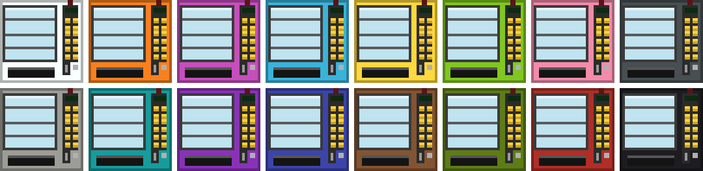

# Diamond Vending

A Minecraft Java Edition mod that adds a **2×2 vending machine** that looks like a real snack
machine and sells items for **diamonds** — with a physical button for each of its 12 items.

- Player-owned shops (stock it, price it, collect diamonds) and admin "infinite" shops
  (datapack catalogs, diamond sink).
- Pay from your inventory or load credit through the coin slot; purchases drop into the tray.
- Dyeable in all 16 colors. Includes a "New Franchise Owner" manual.
- Targets Minecraft **1.20.1** (Forge), **1.21.1** and **26.1.x** (NeoForge and Fabric). No extra library
  dependencies.

> Download the jar for your game from the [releases page](../../releases): `diamondvending-forge-…` for Forge 1.20.1
> (Forge 47.2.0 or newer), `diamondvending-neoforge-…` for NeoForge or `diamondvending-fabric-…` for Fabric (Fabric also
> needs Fabric API), built for Minecraft 1.21.1 or 26.1.x. Put it in your `mods` folder, on the server and on every
> player's game. In game, craft a book with a gold nugget to get the manual. Building from source:
> [dev setup](docs/dev-setup.md).
>
> A world made on 1.20.1 can't be moved to 1.21.1 or newer with machines in it: their contents wouldn't convert.

## Docs

- [Design spec](docs/superpowers/specs/2026-09-23-diamond-vending-design.md)
- [Research notes](docs/research.md)
- [Backlog (deferred ideas)](docs/backlog.md)
- [Datapack catalogs for pack makers](docs/catalogs.md)
- [Release QA checklist](docs/qa-checklist.md)

## License

MIT
